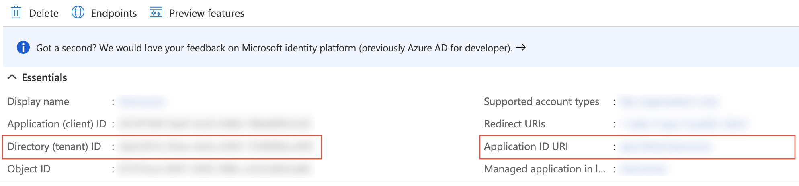

# azure-oidc

Provides a way to put Azure AD bearer token authentication in front of flask and falcon APIs.

## Usage

Find the "Directory (tenant) ID" and "Application ID URI" for your Azure AD app registration, highlighted in red below:



Set up an `OIDCConfig` object with those details as follows:

```python
from azure_oidc import OIDCConfig

tenant_id = ""  # Directory (tenant) ID goes here
config = OIDCConfig(
    base_url=f"https://login.microsoftonline.com/{tenant_id}/v2.0",
    issuer=f"https://sts.windows.net/{tenant_id}/",
    audience=""  # Application ID URI goes here
)
```

### Falcon

To add authentication to Falcon resources, azure-oidc provides a middleware class.

The following example implements a simple echo endpoint with OIDC authentication. A client will only be able to call this endpoint if they provide a valid bearer token with the scope `example_scope`.

```python
import falcon
from azure_oidc.integrations.falcon_middleware import FalconOIDCAuthMiddleware

class Echo:
    auth_scopes = "example_scope"

    def on_post(self, req: falcon.Request, resp: falcon.Response):
        resp.media = req.media

api = falcon.API(middleware=[FalconOIDCAuthMiddleware(config)])
api.add_route("/echo", Echo())
```

Any authentication errors will be raised as `falcon.HTTPUnauthorized` exceptions with useful descriptions.

#### Disabling Authentication

The Falcon authentication is implemented as an opt-out system. If you wish to exclude an endpoint from OIDC authentication, you can specify `auth_disable = True` on the resource. For example:

```python
class EchoNoAuth:
    auth_disable = True

    def on_post(self, req: falcon.Request, resp: falcon.Response):
        resp.media = req.media
```

### Flask

For flask endpoint functions, azure-oidc provides a view decorator.

The following example implements a simple echo endpoint with OIDC authentication. A client will only be able to call this endpoint if they provide a valid bearer token with the scope `example_scope`.

```python
from flask import Flask, request
from azure_oidc.integrations.flask_decorator import FlaskOIDCAuthDecorator

requires_auth = FlaskOIDCAuthDecorator(config)

api = Flask(__name__)

@api.route("/echo", methods=["POST"])
@requires_auth(auth_scopes="example_scope")
def echo():
    return request.json
```

#### Disabling Authentication

Since the Flask implementation in opt-in, to disable authentication on an endpoint simply do not use the `requires_auth` decorator on the relevant view function(s).

#### Error Handling

To handle authentication errors, you may wish to register a Flask error handler such as the following:

```python
from azure_oidc.integrations.flask_decorator import HTTPUnauthorized

@api.errorhandler(HTTPUnauthorized)
def handle_unauthorized(error: HTTPUnauthorized):
    return {"title": "401 Unauthorized", "description": error.description}, 401
```
